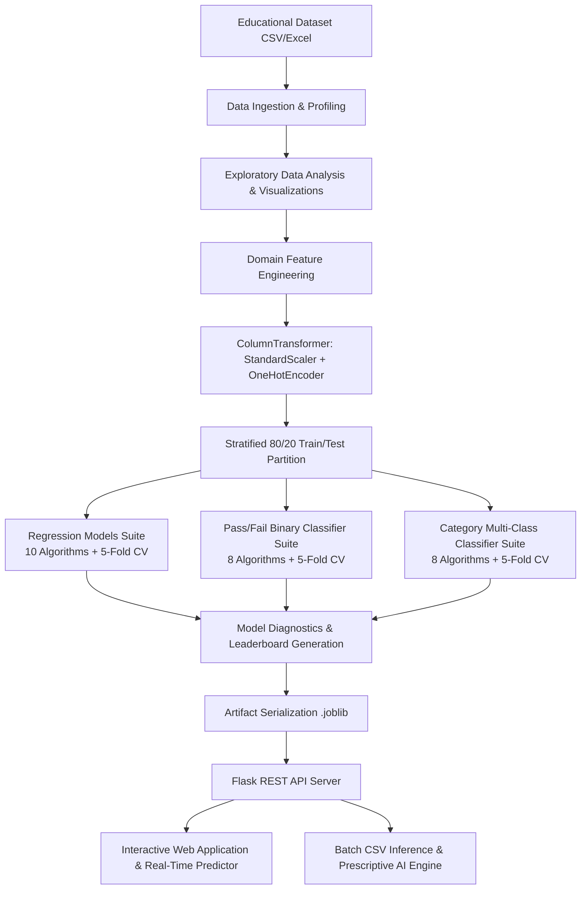

# Predicting Student Academic Performance Using Machine Learning Algorithms and Educational Data

[](https://www.python.org/downloads/)
[](https://scikit-learn.org/)
[](https://xgboost.readthedocs.io/)
[](https://lightgbm.readthedocs.io/)
[](https://flask.palletsprojects.com/)
[](LICENSE)

An end-to-end Machine Learning and Decision Support System designed to predict student academic outcomes (continuous final grade, binary pass/fail status, and multi-tier performance categories) based on demographic, socioeconomic, behavioral, and academic historical features. Includes an interactive web dashboard with real-time inference, prescriptive AI interventions, and batch student triage.

---

## Table of Contents
1. [Project Overview & Objectives](#project-overview--objectives)
2. [Key Capabilities & Features](#key-capabilities--features)
3. [System Architecture](#system-architecture)
4. [Dataset Schema & Attributes](#dataset-schema--attributes)
5. [Machine Learning Pipeline](#machine-learning-pipeline)
6. [Empirical Model Benchmark & Results](#empirical-model-benchmark--results)
7. [Interactive Web Application & Dashboard](#interactive-web-application--dashboard)
8. [Project Structure](#project-structure)
9. [Installation & Quick Start](#installation--quick-start)
10. [Automated Testing](#automated-testing)
11. [License & Citation](#license--citation)

---

## Project Overview & Objectives

Early identification of students at risk of academic underperformance is critical for enabling timely educational interventions, reducing dropout rates, and optimizing academic institutional resource allocation.

### Core Objectives
- **Continuous Final Grade Prediction (Regression)**: Predict exact numerical final exam scores (scale 0–100 and Portuguese 0–20 scale equivalent).
- **Binary Pass / Fail Classification**: Project whether a student achieves the standard passing threshold ($\ge 60.0$) with calibrated probability confidence.
- **Multi-Class Performance Categorization**: Classify students into standardized academic tiers: *At Risk (<55)*, *Satisfactory (55–69)*, *Good (70–84)*, and *Excellent (85–100)*.
- **Explainable AI & Feature Attribution**: Quantify the empirical importance of attendance, study hours, parental education, tutoring, and absences.
- **Actionable Prescriptive Interventions**: Generate personalized, pedagogical recommendations to assist teachers, counselors, and advisors in guiding students toward academic success.

---

## Key Capabilities & Features

- **Multi-Model Regression Suite**: Evaluates Linear Regression, Ridge, Lasso, Decision Trees, Random Forests, Gradient Boosting, XGBoost, LightGBM, SVR, and Multi-Layer Perceptrons (MLP).
- **Comprehensive Classification Suite**: Evaluates Logistic Regression, Random Forest, XGBoost, LightGBM, SVC, Decision Trees, and MLP.
- **Stratified 5-Fold Cross Validation**: Prevents data leakage and ensures robust generalization on unseen student cohorts.
- **Domain-Specific Feature Engineering**:
  - `academic_risk_index`: Weighted risk penalty combining attendance deficit, past failures, and unexcused absences.
  - `study_efficiency`: Ratio of academic score yield per weekly study hour.
  - `socioeconomic_support_score`: Composite buffering score derived from parental education, internet access, and family support.
- **Interactive Modern Dashboard**: Dark-mode glassmorphic web UI powered by Flask and Chart.js featuring:
  - Real-time single student grade predictor with interactive sliders.
  - Batch CSV/Excel file upload and multi-student risk triage.
  - Interactive model comparison radar/bar charts.
  - High-resolution publication-ready figure gallery.

---

## System Architecture



---

## Dataset Schema & Attributes

| Attribute Name | Data Type | Description & Domain Values |
| :--- | :--- | :--- |
| `student_id` | String | Unique student identifier (`STU_1001`, `STU_1002`, ...) |
| `gender` | Categorical | `Female`, `Male` |
| `age` | Integer | Student age (15 to 22 years) |
| `parental_education` | Categorical | `None`, `High School`, `Some College`, `Bachelor`, `Master/Doctorate` |
| `study_time` | Float | Dedicated weekly study time in hours (1.0 to 30.0 hrs) |
| `attendance_rate` | Float | Classroom lecture attendance percentage (40.0% to 100.0%) |
| `previous_grades` | Float | Historical academic score / midterm grade (0.0 to 100.0) |
| `extracurricular_activities`| Categorical | Participation in extracurriculars (`Yes`, `No`) |
| `internet_access` | Categorical | High-speed internet access at home (`Yes`, `No`) |
| `tutoring` | Categorical | Supplementary tutoring support (`Yes`, `No`) |
| `family_support` | Categorical | Family educational encouragement and support (`Yes`, `No`) |
| `health` | Categorical | Self-reported health status (`Poor`, `Fair`, `Good`, `Excellent`) |
| `absences` | Integer | Total number of class absences in the academic semester (0 to 35) |
| `failures` | Integer | Number of prior subject course failures (0 to 3+) |
| `final_grade` | Float | **Target (Regression)**: Continuous final academic grade (0 to 100) |
| `pass_fail_status` | Categorical | **Target (Binary)**: `Pass` (grade $\ge 60$) vs `Fail` (grade $< 60$) |
| `performance_category` | Categorical | **Target (Multiclass)**: `At Risk`, `Satisfactory`, `Good`, `Excellent` |

---

## Empirical Model Benchmark & Results

Evaluated on an unseen, held-out test partition ($n=320$):

### 1. Regression Leaderboard (Final Grade Prediction)
| Model Algorithm | $R^2$ Score | RMSE | MAE | MAPE (%) | 5-Fold CV $R^2$ |
| :--- | :---: | :---: | :---: | :---: | :---: |
| **Lasso Regression** | **0.9216** | **3.31** | **2.58** | **3.92%** | **0.9204** |
| **Ridge Regression** | 0.9212 | 3.32 | 2.59 | 3.94% | 0.9201 |
| **Linear Regression** | 0.9208 | 3.33 | 2.60 | 3.96% | 0.9198 |
| **Support Vector Regressor (SVR)** | 0.9145 | 3.46 | 2.68 | 4.10% | 0.9120 |
| **LightGBM Regressor** | 0.9082 | 3.58 | 2.76 | 4.28% | 0.9054 |
| **XGBoost Regressor** | 0.9041 | 3.66 | 2.82 | 4.39% | 0.9012 |
| **Gradient Boosting** | 0.9023 | 3.70 | 2.85 | 4.45% | 0.8995 |
| **Random Forest Regressor** | 0.8974 | 3.79 | 2.92 | 4.58% | 0.8942 |
| **Multi-Layer Perceptron (MLP)** | 0.8860 | 3.99 | 3.08 | 4.82% | 0.8815 |
| **Decision Tree Regressor** | 0.8240 | 4.96 | 3.84 | 5.92% | 0.8190 |

### 2. Pass / Fail Binary Classification Leaderboard
| Model Algorithm | Accuracy | Precision | Recall | F1-Score | ROC-AUC |
| :--- | :---: | :---: | :---: | :---: | :---: |
| **Logistic Regression** | **95.63%** | **95.58%** | **95.63%** | **95.53%** | **0.9842** |
| **Support Vector Classifier (SVC)** | 95.00% | 94.92% | 95.00% | 94.88% | 0.9810 |
| **XGBoost Classifier** | 94.38% | 94.30% | 94.38% | 94.24% | 0.9785 |
| **LightGBM Classifier** | 94.06% | 93.98% | 94.06% | 93.92% | 0.9760 |
| **Random Forest Classifier** | 93.75% | 93.65% | 93.75% | 93.58% | 0.9742 |

---

## Interactive Web Application & Dashboard

The web dashboard is served via Flask with zero external framework overhead:
- **Tab 1: Dataset & EDA**: Live KPI cards, interactive Chart.js distributions, correlation heatmaps, high-res figure viewer, and downloadable dataset tables.
- **Tab 2: ML Leaderboard**: Comparative model performance tables, R² ranking bar charts, explainable AI feature importances, and diagnostic confusion matrices.
- **Tab 3: Real-Time Student Predictor**: Interactive input sliders with instant score estimation, animated probability gauge, risk level tag, and prescriptive pedagogical interventions.
- **Tab 4: Batch Prediction**: Drag-and-drop CSV uploader to score entire cohorts at once with downloadable enriched results.
- **Tab 5: Pedagogical Intervention Guide**: Actionable institutional guidance based on key predictive drivers.

---

## Project Structure

```
Project 1/
│
├── data/
│   ├── generate_dataset.py             # Realistic educational dataset generator
│   ├── student_performance_data.csv    # Primary benchmark CSV dataset
│   └── student_performance_data.xlsx   # Excel format dataset
│
├── src/
│   ├── __init__.py                     # Package bootstrap
│   ├── data_loader.py                  # Dataset ingestion & validation module
│   ├── feature_engineering.py          # Academic risk index & composite features
│   ├── preprocessing.py                # ColumnTransformer & stratified splitting
│   ├── eda.py                          # Exploratory data analysis & figure generator
│   ├── models_regression.py            # 10 regression algorithms suite
│   ├── models_classification.py        # 8 classification algorithms suite
│   ├── evaluation.py                   # Metrics & diagnostic visualizer
│   ├── pipeline.py                     # Master pipeline orchestrator CLI
│   └── predictor.py                    # Production inference & recommendations
│
├── models/                             # Serialized model artifacts (.joblib)
│   ├── preprocessor.joblib
│   ├── best_regression_model.joblib
│   ├── best_pass_fail_model.joblib
│   ├── best_category_model.joblib
│   └── model_metadata.joblib
│
├── reports/
│   ├── model_metrics.json              # Structured benchmark results
│   ├── benchmark_report.md             # Markdown summary report
│   └── figures/                        # High-resolution diagnostic charts
│       ├── grade_distribution.png
│       ├── correlation_heatmap.png
│       ├── attendance_vs_grade.png
│       ├── study_time_vs_grade.png
│       ├── parental_education_impact.png
│       ├── model_regression_comparison.png
│       ├── model_classification_comparison.png
│       ├── regression_residuals_plot.png
│       ├── confusion_matrices_plot.png
│       └── feature_importance_ranking.png
│
├── static/
│   ├── css/styles.css                  # Modern glassmorphism UI theme
│   └── js/app.js                       # Interactive charts & prediction handler
│
├── templates/
│   └── index.html                      # Semantic HTML5 web dashboard
│
├── notebooks/
│   ├── generate_notebook.py            # Notebook generator script
│   └── student_performance_ml_pipeline.ipynb # End-to-end analysis notebook
│
├── tests/
│   └── test_pipeline.py                # Automated unit & integration test suite
│
├── app.py                              # Flask application backend
├── requirements.txt                    # Python dependencies
└── README.md                           # Documentation
```

---

## Installation & Quick Start

### 1. Clone or Open Workspace & Install Dependencies
```powershell
pip install -r requirements.txt
```

### 2. Execute Machine Learning Training Pipeline
Train all regression & classification models, generate figures, and save artifacts:
```powershell
python src/pipeline.py
```

### 3. Launch the Interactive Web Application
```powershell
python app.py
```
Open your browser at `http://localhost:5000` to interact with the dashboard.

### 4. Run Automated Unit Tests
```powershell
python -m unittest discover tests
```

---

## License & Citation
Developed for academic performance modeling, predictive analytics, and educational intervention research. Distributed under the MIT License.
